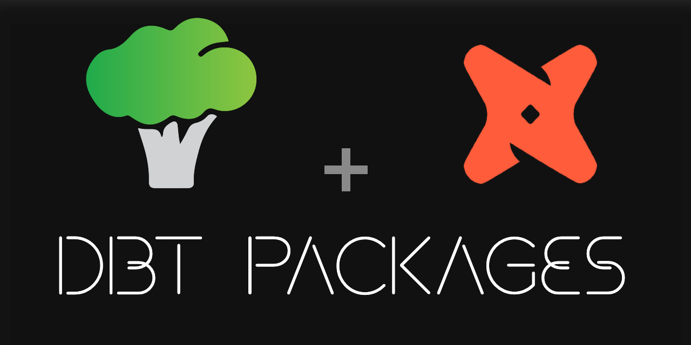

# dbt_packages
Repository that contains all dbt packages created by Brocoli Data

## List of dbt projects
| dbt project name & link                          | Description of the project                  |
|--------------------------------------------------|---------------------------------------------|
| [adventure works](src/adventure_works/README.md) | Adventure Works demo data                   |
| [currencies](src/currencies/README.md)           | Currencies rate compared to Moroccan Dirham |
| [freight](src/freight/README.md)                 | Shipping Container Price Index              |
| [fuel](src/fuel/README.md)                       | Fuel prices in Casablanca, Morocco          |

## Quickstart
1. Make a copy of **.env.example** named **.env** in the **root folder**  then replace dummy values with yours in both files
2. Add your credential file in `credentials` folder (rename the file to `google_credentials.json`) for local development purposes
2. Run the [Development start](#development-start) process to create the image
3. Open a Remote Window  *(click on blue button left-down corner and click "Reopen in Container)*

## Development start
The first time you clone the project and each time you make changes to the Dockerfile, rerun
```
docker compose -f docker_build/docker-compose.yml build
```

## Useful links
- [Create a brocoli dbt package](src/brocoli_dbt_packages.md)
- [dbt Style Guide](src/dbt_style_guide.md)
- [Release a brocoli dbt package](release.MD)
- [CI/CD pipelines](.github/workflows/CI_CD_pipelines.md)
